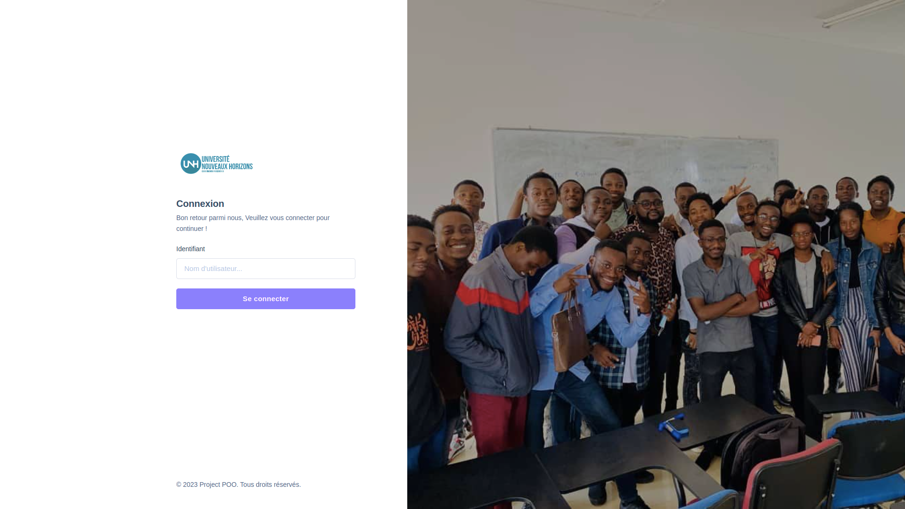
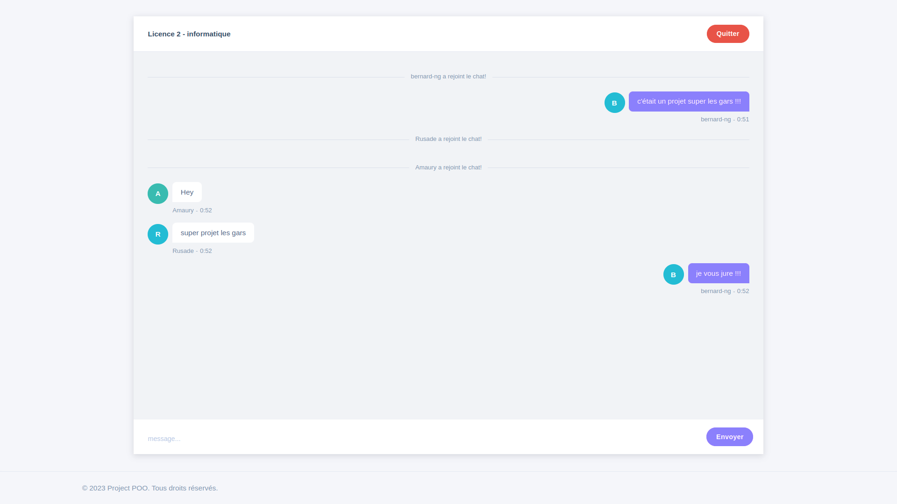

# Java springboot websocket chat
University L2 project (2022-2023) : JAVA spring boot  websocket chat

L'ère de la communication en ligne est en constante évolution et les applications de chat en groupe sont devenues un outil essentiel pour connecter les utilisateurs du monde entier. Dans ce contexte, nous sommes ravis de présenter notre application de chat en groupe utilisant la technologie WebSocket, développée en utilisant le langage de programmation Java.

Notre application de chat en groupe offre une plateforme sécurisée et interactive permettant aux utilisateurs de créer des salons de discussion, d'inviter leurs amis et de partager des messages en temps réel. Grâce à la technologie WebSocket, cette application permet une communication bidirectionnelle en temps réel entre le serveur et les clients, offrant ainsi une expérience utilisateur fluide et instantanée.

## Fonctionnalités principales :
* Connexion au réseau local : L'application utilise une technologie de communication WebSocket pour faciliter la connexion des utilisateurs au réseau local. Il leur suffit de se connecter à leur réseau Wi-Fi et d'entrer les informations de connexion fournies.
* Nom d'utilisateur personnalisé : Chaque utilisateur peut spécifier un nom d'utilisateur unique, ce qui lui permet d'être identifiable par les autres membres du groupe. Cela facilite la communication et crée un environnement convivial.
* Discussions en groupe : Une fois connecté, l'utilisateur peut accéder à une liste des différents groupes de discussion disponibles dans le réseau local. Il peut choisir de rejoindre un groupe spécifique ou créer son propre groupe s'il le souhaite. Les messages envoyés par un utilisateur sont visibles par tous les autres membres du groupe, permettant ainsi les conversations en temps réel.
* Fonctionnalités de base de discussion : L'application de chat en groupe offre des fonctionnalités de base telles que l'envoi de messages texte, l'envoi de fichiers, l'ajout de réactions aux messages et la suppression de messages inappropriés. Ces fonctionnalités facilitent la collaboration et favorisent une expérience de discussion fluide.

## Développement et introduction technique au projet

  

## Documents
- [Requirements](presentation/2_poo_unh_cahier_23.pdf)
- [Speciations](presentation/2_poo_unh_besoins_23.pdf)
- [UML Diagrams](presentation/2_poo_unh_uml_23.pdf)

  ## Screenshots

## Team 
- CANSA KAYEMBE AMAURY
- KINYANTA NKONKOSHA DANIEL
- KAYOMBO KAKANGA RUSADE
- MWENDA MUKUNTU MIKE
- TSHABU NGANDU BERNARD

